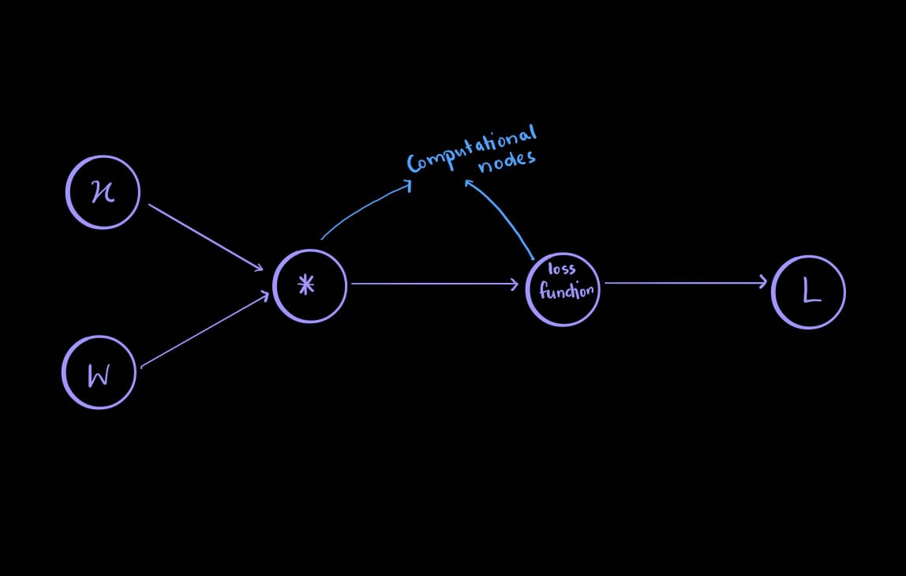
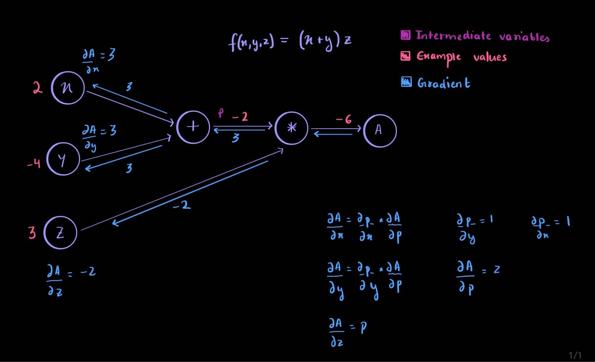

# Backpropagation
Okay so, I'm sure theoretically, gradient descent makes sense to you. We find the gradient (the derivative) of each neuron with respect to the loss, and change it such that the loss goes down. Okay.. but how? That's where backprop makes a dramatic entry. But before we jump into the flash bang grenade that is backprop, let's just go over neural networks as computational graphs once. 

## Computational Graphs
Neural networks can be thought of as computational graphs. For example: 

  

Where each computational note represents a different operator. The "*" is the matrix multiplication, and if the loss function was SVM, that computational node would be a max function. We could split the actions even further, all the way down to additition... but that isn't necessary. Why even this level of splitting is needed, we'll see when we compute the gradient in the next graph.  

 
