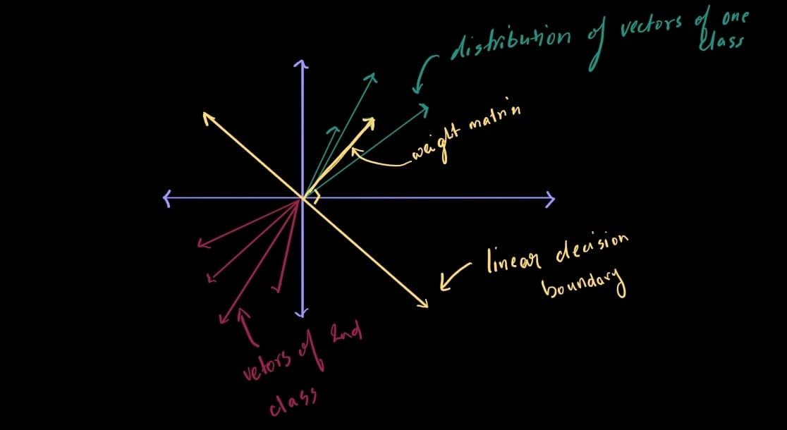

# Image Classification Pipeline
## The Semantic gap
To understand the semantic gap, one must ponder the seemingly stupid question- How would you write an algorithm to identify a cat. One might sketch out a shape, but they deform, move, stretch and hide under furniture. No matter what you try to do, you will not be able to explicitly write a hardcoded algorithm for identifying a cat. Or any object for that matter.  

There are so many aspects subject to change. i.e illumination, deformity, occlusion, background clutter, inter-class variations( tabby or siamese ), etc. ( wtf even is a cat )  This is just in the real world... images are just matrices of RGB values — the cat isn’t in the pixels, it’s in our interpretation. <- On a side note, people TRIED to write explicit algorithms... I'm not joking ->  

Therefore, we must ditch this approach entirely. Here, we'll go through two elementary methods of classifying images.
## Nearest Neighbour Classifier
This is probably the simplest algorithm one might imagine. Memorise all the data, and for whatever image you must classify, compare it to ALL the images in your training data, then output the class of the closest match.  

Theoretically, if we had all the image data in the world as our training set, and infinite compute, this would be the perfect classifier. But we don't... so it ends up being slow and inefficient in practice.  

One might think about the possible classes as probability distributions and the image to be classified as the observation. Then, since we do not possess infinite data, we must guess which probability distribution the observation belongs to despite incomplete knowledge of the full underlying distribution.  

<- The Nearest Neighbour program is often wrongly attributed to a 1951 paper by Fix and Hodges. They came up with a method for guessing which probability distribution the observation belongs to given an observation. But, the term nearest neighbour and its application in a classification problem was first done by Cover and Hart in 1967 [^1]. They do mention Fix and Hodges approach in their introductory paragraphs, but do not build upon it. And that’s important — because knowing who did what helps us understand how the field actually progressed, not how it’s been summarized over time. ->

### Distance Metrics
Now, we must address what comparing two images even entails. How does one compare a matrix of RGB values with some way of capturing the intrinsic meaning. Turns out, one doesn't. We use rather silly algorithms for comparing two images. Or rather, calculating their distance. The higher the distance, the more different the images. 
- **L1 Distance**: The L1 distance or rather the Manhattan distance, involves subtracting pixel values. Pixel wise absolute difference.  
  	                                                
d(I₁, I₂) = ∑|I₁ - I₂|

  As one would realise, any similar looking image will be classified the same. If there are two images with a blue background having a white blob in the middle, both will be classified as one class, even if one blob is a dog and the other a toaster. 

- **L2 Distance**: The L2 or the Euclidean distance does the same thing... also measures pixel-wise differences, but squaring the differences gives more weight to large deviations, making it more sensitive to outliers and smoother.  
                                                  
 d(I₁, I₂) = √( ∑(I₁ - I₂)² ) 

  If unfamiliar to vector geometry, Intuition can be built as follows- the Manhattan distance metric ensures you stick to the x and y axis... like a difference of the magnitude of the vectors. The Euclidean Distance would then be the hypotenuse between two perpendicular vectors ( Instead of in 2d, in some confounded dimensional space ).   

In this manner, a nearest neighbour classifier will compare the test image ( the image to be classified ), with all the images in the training data, and output the class of the image with which the distance is least.  

**K-Nearest Neighbour**: Takes a majority vote among K nearest neighbours. If all k nearest neighbours ( images with least distance ) have different classes, we either pick at random or choose the one with the lowest distance.
[^1]: Cover, T. M., & Hart, P. E. (1967). *Nearest Neighbor Pattern Classification*. [IEEE link](https://isl.stanford.edu/~cover/papers/transIT/0021cove.pdf)

## Linear Classifier
A linear classifier is a method of classifying an image ( or something else ) using a linear decision boundary. On a 2d plane, this would look like a line separating the plane, each part of the plane representing a different class.
### Implementation
Given a flattened input image X \[D × 1], K classes, a weight matrix \[K × D] and a bias vector \[K × 1], a linear classifier would be implemented as follows:
                                          
 f(x, W ,b) = Wx + b 

This reprsents the dot product of column vector X with each row which yields a column vector \[K × 1] to which the bias vector is added. The final output of the classifier is a vector \[K × 1] in which each row represents the score for that class. The class with the highest score (via argmax) is the predicted class. diagram  

<- Sometimes, the weight matrix is a vector of the form \[D × K], so the classifier looks like f(x, W ,b) = Wᵀx + b i.e we transpose the weight matrix ( it works out to be the same just a notation thing ) ->  

W and b are the variables under our control. To "optimise" a linear classifier we must find their ideal values such that the linear classifier classifies correctly.  

Note that the linear classifier can only classify linearly separable data.

### Geometrical intuition

  
  
In the above cartesian plane, we may assume that the x and y axes are representing some abstract quantity ( ik that's vague but we'll run with it for now ) based on which the classifier is plotting the image vectors. ( Often one might see images represented as points. Those points are the end of the image vector that starts at the origin. )   

We wish to classify the green vectors as positive and the red ones are negative.  

The yellow arrow represents the ideal weight vector for classifying the green class. It points in the direction of highest concentration of the green vectors and is of their most common magnitude. The yellow line, the linear decision boundary, represents the tipping point of the decision. It forms a 90 degree angle with our ideal weight vector.  

A vector lying exactly on the boundary ( perpendicular to the weight vector ) yields a dot product Wxcos(θ) of zero and belongs to neither class. It is at the threshold for the decision. The dot product for a vector that forms an acute angle with W is positive. The dot product for all obtuse angles, vectors beyond the line, is negative. Keep in mind that the geometric and algebraic definitions of a dot product are equivalent.  

Therefore:  
Wx = 0 is the decision boundary  
Wx > 0 means the class is green  
Wx < 0 means not green, by implication red.   

<- One important thing to note, is that this line is only capable of saying green and not green, which in our case leaves the only other option red. Unless the vectors for both classes are symmetrically spread out in space, the ideal weight vector for red will not simply be the negative of the green weight vector, but something else entirely. ->  

In higher dimensions, this linear decision boundary will be a hyperplane. ( Trust me, it's pointless to visualise above 3d. In 4d you could imagine the hyperplane as a cube but it doesn't help with much. )  
If a hypothetical two pixel image is fed into the classifier without any preprocessing, each axis will simply represent pixel intensity. In a higher dimensions, we end up representing color intensities for each pixel. In later models, such as CNNs, preprocessing and learned feature maps help push the input into more abstract spaces — So each axis represents higher-order features like texture, shape, or ‘dog-ness’ rather than just raw pixel intensities. <- Honestly though, we don't even know what our best models are mapping atp... we just know it works ->

### Iris setosa and Iris versicolor
