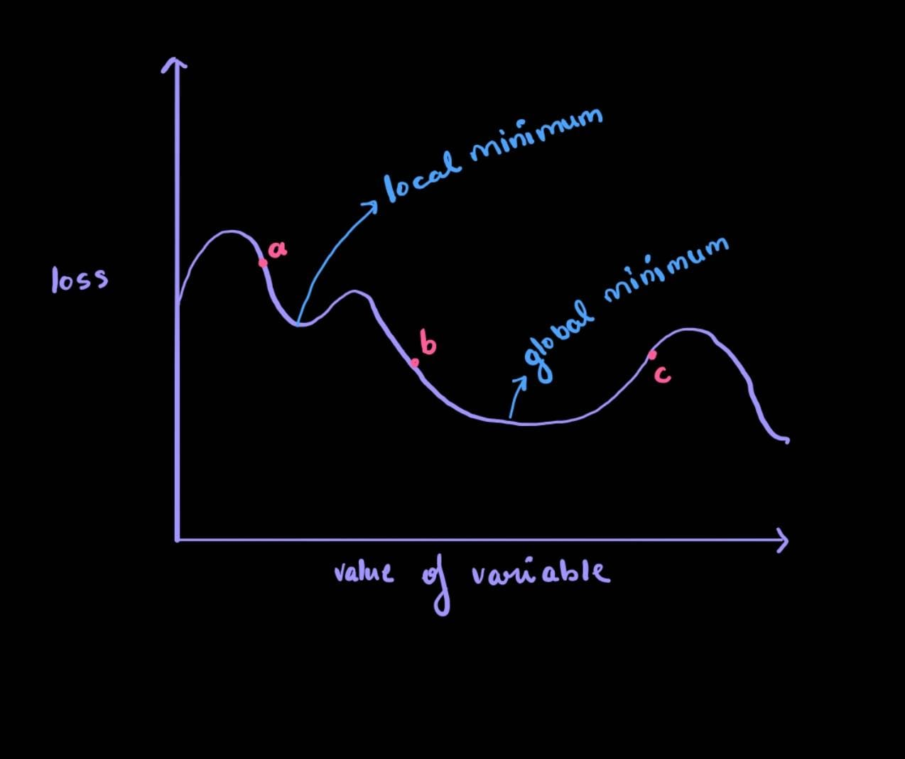

**Note: Don't read this if you're unfamiliar with derivatives. I'll add notes about those somewhere here and link them**
# The Problem  
For any model, there will be an ideal set of parameters, which will yield the lowest loss. Those are the parameters we want the model to have. Okay but how do you figure out which parameters those are, out of inifinitely many possbile weights and biases. 

Well... you could just guess randomly until it works... but you'd have better luck winning the lottery five times in a row.  

# Gradient Descent
Assume a model with only one variable subject to change. For a certain value of this variable, the loss is at its absoulte lowest possible value (global minimum). But, you don't know where this is... all you know is your current loss. 

  
 

Assume we start off at point c. We don't know what the curve looks like at any point except c. We need to get to the global minimum. We also know, that to find the slope at any point, we can calculate the derivative. The derivative by definition is the slope of the line tangent to the curve at that point. So, to go "down" i.e to minimize the loss, we must take a "step" in the direction negative to the gradient.  

Let's set aside the specifics of taking a "step". Near any minimum, for a gentle curve, the slope will approach zero from both sides, and be 0 at the minimum. That is how we know we are there.  
If we start at point b or point c, and take steps in the negative derivative direction, we will eventually reach the global minimum  
But, if we start at point a, we will reach a place where the derivative is 0, but we are not at the global minimum. Instead, we will get stuck in a local minimum. This will also be true for saddle points. Basically any place where the derivative is zero.   
To prevent this, and ensure we are truly at the global minimum, we employ various strategies. But the simplest is ensuring our step size (learning rate) is the baby bear. Just right. Not too big and not too small. We won't overshoot the global minimum, but we also won't get stuck in local minimums.  

There's a lot of analogies to explain gradient descent. Ball rolling down a hill or blind main trying to find the path by touching the ground. Me, I've never been one for analogies in maths, but if it helps you get the concept better, go for it.

## Gradient 
In a single dimension, a gradient is just the derivative. But, as you go to higher dimensions, More variables affect your loss. In 3 dimensions, you need to change two variables simultaneously to achieve the optimal loss. Don't visualise beyond that. But, to convey "direction" in these high dimensional spaces, we use a vector of partial derivativves which we call the gradient.  

**Slope**: The slope is the dot product of a unit vector with the gradient. It basically tells you how changing that one variable will affect the entire loss. Like cutting planes across a 3d landscape. Going from the gradient to the partial derivative.  

Also, in practice, we never calculate the numerical gradient. Instead we use analytical gradient. Yay to really hard calculus. (dw i got you for that as well)

